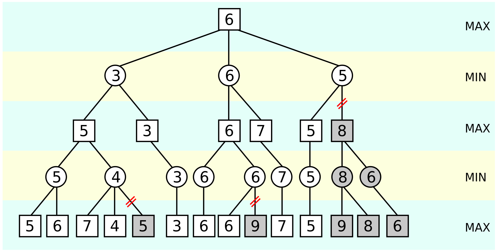

# Proyecto de Aprendizaje
## Seminario II - Inteligencia Artificial en Agentes Autónomos
### Autor    :  Daniel Espinoza / Ian Roberts / Juan Pablo Sánchez / Jorge Veliz
### Profesor : Mauricio Araya 

El enfoque de esta tarea involucra la comparación de métodos de búsqueda y decisión en teoría de juegos, como son **minimax** y **alphabeta**, aplicados al juego de ajedrez.
# Tabla de Contenidos
1. [Objetivos](#id0)
2. [Instalación](#id1)
3. [Descripción del problema](#id2)
4. [Algoritmos de aprendizaje](#id3)
    * [Minimax](#id3.1) 
    * [Alphabeta](#id3.2)

# Objetivos 

* Implementar métodos de aprendizaje para el juego de ajedrez.
    * Utilizar el método minimax
    * Utilizar el método alphabeta
* Comparar ambos algoritmos 
* Generar un agente óptimo que usando los algoritmos se pueda enfrentar a un jugador humano. 

# Instalación 

El proyecto utiliza Python en una versión superior a 3.0. Esta implementación en particular fue desarrollada en Python 3.8.10 utilizano la biblioteca `python-chess`.

1. Instalar dependencias de `python-chess`.
~~~~
pip install python-chess
~~~~

2. Clonar el repositorio.
~~~~
git clone git@github.com:D-Cryp7/T3-TEL352.git
~~~~

3. Configurar path de `stockfish_10_x64.exe` dentro del archivo `evaluate.py` en la carpeta evaluate en la línea:
~~~~
chess.engine.SimpleEngine.popen_uci(r"PATH/TO/stockfish_10_x64.exe")
~~~~

3. Iniciar el programa para ejecutar ajedrez con el método `minimax`.
~~~~
python3 main.py minimax
~~~~

4. Iniciar el programa para ejecutar ajedrez con el método `alphabeta`.
~~~~
python3 main.py alphabeta
~~~~

# Descripción del problema 

Se plantea una implementación basada en el juego de ajedrez. Este es un juego de tablero donde participan dos jugadores que se enfrentan entre sí, cada uno dispone al comienzo del juego 16 piezas móviles que son ubicadas en posiciones determinadas sobre un tablero de dimensiones 8x8.

Este es un juego de estrategia donde cada jugador busca *derrocar* al rey oponente amenazando con las piezas de modo que este sea incapaz de moverse a posiciones seguras mientras se protegue al rey propio. Esta situación donde el rey no tiene movimientos  

 <figcaption align="center">Diagrama del tablero y piezas de ajedrez</figcaption>

El tablero consiste de un cuadrado de dimensiones 8x8 donde se tienen en total 64 casillas de colores blanco y negro intercaladas entre si. Las filas del tablero son identificadas con números mientras que las columnas con letras de modo que cada casilla puede ser identificada con con un par coordenado de letra y número (Por ejemplo casilla B4, casilla G8, etc.) 

Además cada jugador cuenta con un set de 16 piezas ubicadas al comienzo del juego en los extremos del tablero como se muestra en la imagen anterior. Las piezas se componen de 8 peones, 2 torres, 2 caballos, 2 alfiles, el rey y la reina, cada uno con sus mécanicas propias.

- Peón : Pieza básica identificada con una (P o p). Esta pieza se mueve verticalmente por la columna en la que se encuentra y es incapaz de retroceder. Puede capturar o *comer* otra pieza moviendose en diagonal 1 espacio hacia al frente.   
- Torre : Pieza identificada con una (R o r) en el tablero. Esta pieza es capaz de en linea recta por la columna o la fila en la que se encuentre sin poder pasar por otra pieza en su camino a menos que busque capturarla.
- Caballo : Pieza identificada con una (N o n) en el tablero. Este posee un movimiento especial en forma de L y a diferencia de otras piezas puede saltar por piezas intermedias para llegar a su destino. 
- Alfín : Pieza identificada con una (B o b) en el tablero. El alfín es capaz de de forma similar a la torre solo que en sentido diagonal.

- Reina : Pieza identificada con una (Q o q) en el tablero. La reina tiene la mayor movilidad dentro del juego ya que puede desplazarse en todo sentido integrando el desplazamiento del alfín y la torre en una sola pieza.

- Rey : Pieza identificada con una (K o k) en el tablero. El rey por último, es la pieza más importante del juego y puede desplazarse en todo sentido como la reina pero solo una cuadrícula a la vez.

## Movimientos y coordenadas

Al ejecutar el programa, el juego dará comienzo dando paso al turno del jugador para que pueda realizar su movimiento seguido del turno de la máquina que calculará las posibilidades y realizará un movimiento en respuesta al jugador utilizando el algoritmo minimax o alphabeta según como se haya definido.

En cada turno del jugador, se pedirá ingresar el movimiento siguiendo el formado **Columna1Fila1Columna2Fila2** donde *Columna1Fila1* representa la coordenada donde se encuentra la pieza del jugador que quiera moverse y *Columna2Fila2* representa la coordenada a donde se desee mover la pieza.

 <figcaption align="center">Movimiento peón de F2 a F4</figcaption>

Replicanto la situación anterior, si desearamos mover dentro de nuestro tablero el peón ubicado en la posición F2 a la coordenada F4 tendríamos que ingresar por consola el siguiente movimiento:

~~~~
Ingrese un movimiento: f2f4
~~~~

 <figcaption align="center">Movimiento caballo en C3 a D5</figcaption>

En el siguiente ejemplo, al avanzar la partida contra el ordenador, si se buscara movilizar el caballo de su posición actual en C3 a la casilla en D5 para capturar el peón del oponente se debería realizar la jugada en el formato: 

~~~~
Ingrese un movimiento: c3d5
~~~~

 <figcaption align="center">Resultado del movimiento del caballo a D5</figcaption>

Cabe mencionar que las imagenes anteriores son referenciales para entender el funcionamiento de los movimientos de manera visual. El funcionamiento del ajedrez implementado funciona por consola desplejandose el tablero de la siguiente contexto:

 <figcaption align="center">Tablero de implementación main.py</figcaption>

Donde las letras mayúsculas representan al jugador humano controlando las piezas blancas que juegan en el primer turno, mientras que las letras mayúsculas representan al oponente controlado por el agente que utiliza los algoritmos minimax o alphabeta para tomar decisiones. Cada vez que el jugador tome una acción el agente oponente calculará las opciones posibles y se procede al siguiente turno del jugador desplegando el tablero actualizado con la jugada del ordenador.

# Algoritmos de aprendizaje 

Dentro de la implementación utilizamos 2 algoritmos asociados con la teoría de juego para que la máquina encuentre la mejor jugada posible con la que poder responder a nuestros movimientos, estos corresponden a `minimax` y `alphabeta` ubicados en la carpeta `methods`.

# Minimax 

Este método busca minimizar las perdidas obtenidas basandose en el peor caso posible. Como su nombre lo indica, es una mezcla de máximos y mínimos buscando obtener la máxima ganancia cuando deba hacer su movimiento y seguir el camino que minimice las pérdidas en respuesta al movimiento del oponente. 

Por esta razón, Minimax puede visualizarse como un arból de decisión con las ganancias asociadas que se van obteniendo en cada caso. Aquí se va intercalando el proceso de maximizar o minimizar representando que es la acción propia seguido de la acción oponente. Así se comienza de un nodo raiz que se va expandiendo según las posibles jugadas que pueda realizar el oponente. Esto se calcula con cierta profundidad con la finalidad de tener un número de predicciones que seguir según las acciones que se realicen. 

 <figcaption align="center">Minimax</figcaption>

Debido a que Minimax calcula cada posible ramas y luego toma decisiones el proceso resulta lento especialmente en casos donde el número de posibles acciones escale considerablemente incrementando el tiempo de cálculo y revisión.   

Para la implementación se utilizará la función `minimaxAlgorithm` que calcula la mejor jugada y el puntaje asociado a ella a partir del tablero con cierta profundidad. Esta función recibe como parámetros la Profundidad a explorar la jugada, el tablero que contiene las posiciones actuales de las piezas y por último un valor booleano que permite al agente saber si debe maximizar o minimizar según sea su turno o no.

# Alphabeta 

Por otro lado, este puede ser considerado como una variante de Minimax que busca disminuir el tiempo de ejecución mediante la reducción de nodos que deban ser explorados cortando ramas que no serían eficientes.

Ante esto Alphabeta, basandose en el caso de 2 jugadores que buscar maximizar y minimizar respectivamente su recompensa, le es suficiente con seguir una serie de movimientos que sea considerados como buenos y no supongan altos riesgos para sus ganancias. 

 <figcaption align="center">Alphabeta</figcaption>

Gracias a que esta búsqueda descarta caminos, en teoría debería ser más eficiente en terminos de tiempo especialmente si se tienen múltiples opciones pero depende mucho del orden con el que explore los movimientos siguientes. Eso significa que el algoritmo se comportará de forma más eficiente si examinamos primero los sucesores que probablemente serán los mejores

Para la implementación se utilizará la función `alphaBetaAlgorithm` que calcula la mejor jugada y el puntaje asociado a ella a partir del tablero con cierta profundidad. Esta función recibe como parámetros la Profundidad a explorar la jugada, el tablero que contiene las posiciones actuales de las piezas y por último un valor booleano que permite al agente saber si debe maximizar o minimizar según sea su turno o no.